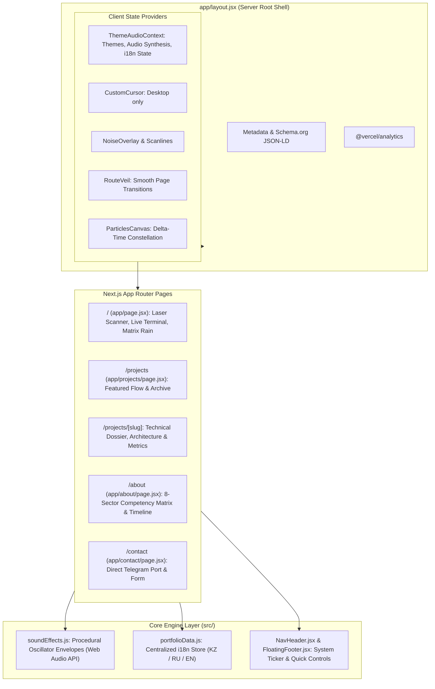

<p align="center">
  
</p>

<h1 align="center">daelijekPortfolio // Dias Yermek</h1>

<p align="center">
  <strong>Кибер-инженерное HUD-портфолио & Архитектурная витрина продакшн-проектов</strong><br>
  <em>Cyber-Engineering HUD Portfolio: Procedural Audio Synthesis, 60 FPS Canvas Shaders, Next.js 16 & Deep Technical Dossiers.</em>
</p>

<p align="center">
  <a href="#-о-проекте-и-концепции">Концепция</a> ·
  <a href="#-ключевые-инженерные-фичи">Фичи</a> ·
  <a href="#-архитектура-системы">Архитектура</a> ·
  <a href="#-технологический-стек">Стек</a> ·
  <a href="#-проекты-и-кейсы">Кейсы</a> ·
  <a href="#-быстрый-старт">Быстрый старт</a> ·
  <a href="#-контакты">Контакты</a>
</p>

<p align="center">
  
  
  
  
  
  
  
  
</p>

---

## ⚡ О проекте и концепции

Большинство сайтов-портфолио представляют собой статичные визитки, созданные по типовым шаблонам. **daelijekPortfolio** спроектирован с противоположным подходом: как **интерактивная бортовая операционная система инженера (Cyber-Engineering HUD)**.

Проект решает сразу две ключевые задачи:
1. **Демонстрация технической глубины и зрелости кода**: наглядное подтверждение владения современными стандартами фронтенда — от процедурного синтеза звуковых волн и математических 60 FPS шейдеров на Canvas до строгой серверной SEO-оптимизации и масштабируемого роутинга в Next.js App Router.
2. **Интерактивные детальные кейсы (Dossiers)**: каждый флагманский проект снабжен исчерпывающим разбором архитектуры, диаграммами потоков данных, замерами метрик и решениями сложных инженерных вызовов.

> **Статус деплоя:** Продакшн на Vercel · 100% покрытие мобильных экранов · Нулевой объем загружаемых аудиофайлов · Полная локализация на 3 языка (Казахский, Русский, Английский).

---

## 🎯 Для кого этот репозиторий

| Роль | Что здесь ценно и на что обратить внимание |
| --- | --- |
| **Tech Leads & CTO** | Чистота архитектуры, изоляция серверных и клиентских слоев Next.js, отсутствие техдолга, Turbopack-сборка за <1 сек, 0 внешних аудио-зависимостей. |
| **Frontend & Mobile Reviewers** | Кастомный Web Audio API синтезатор частот, delta-time нормализация физики анимаций, чистая адаптивность без дерганий, строгий i18n-пайплайн. |
| **Recruiters & HR-команды** | Подробная матрица компетенций по 8 секторам, история коммерческого опыта в EdTech, GovTech, FinTech и Web3, проверенные продуктовые результаты. |

---

## 🚀 Ключевые инженерные фичи

### 1. Процедурный синтезатор звука на Web Audio API (0 KB ассетов)
В проекте **полностью отсутствуют аудиофайлы** (`.mp3`, `.wav`). Все звуковые эффекты (тактильные щелчки, высокочастотные наведения, загрузочные аккорды, свипы открытия модалок) генерируются в реальном времени с помощью программных осцилляторов:
- Управление огибающими громкости (`exponentialRampToValueAtTime`).
- Динамический выбор типов волн: `sine`, `triangle`, `sawtooth`.
- Два переключаемых звуковых профиля: **Ambient / Lo-Fi** и **Digital Cyber / Retro Synthwave**.

### 2. Графический конвейер Canvas 60 FPS с Delta-Time нормализацией
- **Лазерный сканер текста реального времени (`TrueLaserScanner`)**: процедурное свечение, математический расчет пересечения лазерного луча с глифами шрифта, неоновые шлейфы.
- **3D Квантовая координатная матрица (`QuantumMatrixBackground`)**: перспектива трехмерной плоскости с волнообразным возмущением узлов по синусоидальным законам.
- **Интерактивное созвездие узлов (`ParticlesCanvas`)**:
  - *На десктопе:* физическая модель отталкивания частиц от курсора с динамическим сглаживанием координат и отрисовкой связей-созвездий.
  - *На смартфонах / тач-экранах:* система автоматически определяет отсутствие указателя мыши и переключается в **автономный режим орбитального дрейфа** — фоновые узлы оживают без дерганий и не создают паразитной нагрузки на event loop тач-событий.
- **Бинарный дождь матрицы (`CyberMatrixRain`)**: нормализованная по `dtModifier` кинематика символов, гарантирующая одинаковую скорость отрисовки на 60 Hz, 120 Hz и 144 Hz дисплеях.

### 3. Глубокие архитектурные кейсы (`/projects/[slug]`)
Для каждого флагманского проекта реализована интерактивная страница-досье:
- **Finance AI Manager** (React Native, Expo, FastAPI, Python, PostgreSQL).
- **BeyimTech AI Platform** (Flutter, Riverpod, Dart, AI Engine — деплой в 20+ школах).
- **OpenGov.kz Portal** (Next.js 15, React, GovTech high-load Open Data streaming).
- **BerikWeb 3D Gallery** (HTML5, Vanilla JS, 3D Canvas, Retina Multilanguage).
- Каждое досье включает стек, целевую аудиторию, вызовы безопасности, метрики производительности и прямые ссылки на production/demo.

### 4. Полноценная интернационализация (KZ / RU / EN)
- 100% паритет ключей во всех трех локалях: **Казахский (`kk`)**, **Русский (`ru`)**, **Английский (`en`)**.
- Мгновенное переключение без перезагрузки страницы с сохранением в `localStorage`.
- Локализовано абсолютно всё: системный лог прелоадера, бегущая строка, матрица из 8 секторов, досье проектов и формы обратной связи.

### 5. Динамические темы HUD
- **Obsidian White** (`#FFFFFF`) — строгий высококонтрастный режим.
- **Cyber Cyan** (`#00F3FF`) — неоновый бирюзовый sci-fi.
- **Acid Green** (`#00FF9F`) — киберпанк / терминал.
- **Amber Gold** (`#FFB800`) — теплый янтарный HUD.
- **Crimson Red** (`#FF0055`) — агрессивный системный алерт.

### 6. Продакшн SEO & OpenGraph микроразметка
- Серверная генерация тегов `metadata`, `openGraph` и `twitter` для каждого маршрута.
- Автоматическая генерация [`app/sitemap.js`](file:///c:/WorkProject/My%20Projects/daelijekPortfolio/app/sitemap.js) и [`app/robots.js`](file:///c:/WorkProject/My%20Projects/daelijekPortfolio/app/robots.js).
- Внедрена разметка **Schema.org** (`Person`, `WebSite`, `ProfilePage`).

---

## 🏗 Архитектура системы

Проект построен по модульному принципу в парадигме Next.js App Router:



### Разделение ответственности компонентов:

| Компонент / Директория | Роль в системе | Особенности реализации |
| --- | --- | --- |
| `app/layout.jsx` | Серверная оболочка | Инъекция SEO, Schema.org, предзагрузка системных шрифтов (`woff2`), провайдеры контекста |
| `app/projects/[slug]/` | Динамические кейсы | Детальный парсинг слага, фолбэк для архивных утилит, вкладки спецификаций |
| `src/context/ThemeAudioContext.jsx` | Глобальное состояние | Управление цветовой темой, профилем звука, уровнем производительности и языком |
| `src/audio/soundEffects.js` | Звуковой движок | Чистый Web Audio API, Zero-Latency синтез через стек `GainNode` и `OscillatorNode` |
| `src/components/home/` | Визуальные HUD-модули | `TrueLaserScanner`, `TelemetryHUDPod`, `QuantumMatrixBackground`, `CyberMatrixRain` |
| `src/components/common/` | Системные оверлеи | `CustomCursor` (с определением `pointer: fine`), `ParticlesCanvas`, `RouteVeil`, `NoiseOverlay` |
| `src/data/portfolioData.js` | Единая база знаний | 100% строгая типизированная структура для `en`, `ru`, `kk` |

---

## 🛠 Технологический стек

```text
├── Фреймворк:          Next.js 16.3.3 (App Router, Turbopack)
├── UI-библиотека:      React 19.2.8
├── Стилизация:         Tailwind CSS 3.4.19 + кастомные CSS-переменные дизайн-системы
├── Анимации:           Framer Motion 13.1.1 + Canvas 2D Context API
├── Звуковой синтез:    Web Audio API (Procedural Oscillators)
├── Иконки:             Lucide React + React Icons (FaGithub, SiTelegram)
├── Интерактивность:    Canvas Confetti 1.9.4
├── Аналитика:          @vercel/analytics 1.6.1
└── Шрифты:             CsGenio & Denominary (локальные woff2 без внешних запросов)
```

---

## 📁 Структура репозитория

```text
daelijekPortfolio/
├── app/                              # Next.js App Router (Маршруты и серверные страницы)
│   ├── about/
│   │   ├── AboutContent.jsx          # Клиентский UI: философия, матрица секторов, таймлайн
│   │   └── page.jsx                  # Серверный компонент с SEO-метаданными
│   ├── contact/
│   │   ├── ContactContent.jsx        # Клиентский UI: форма, копирование email, конфетти
│   │   └── page.jsx                  # Серверный компонент с SEO-метаданными
│   ├── projects/
│   │   ├── [slug]/
│   │   │   └── page.jsx              # Интерактивное досье кейса (архитектура, метрики, стек)
│   │   ├── ProjectsContent.jsx       # Список проектов, бейджи, ссылки на кейсы
│   │   └── page.jsx                  # Серверный компонент с SEO-метаданными
│   ├── layout.jsx                    # Главный layout: метаданные, провайдеры, оверлеи
│   ├── page.jsx                      # Главная страница: лазерный сканер, матрица, телеметрия
│   ├── robots.js                     # Автогенератор /robots.txt
│   └── sitemap.js                    # Автогенератор /sitemap.xml
├── public/                           # Публичные статические ассеты
│   ├── assets/                       # Оптимизированные превью проектов и портрет
│   ├── fonts/                        # Локальные оптимизированные шрифты woff2
│   └── images/                       # Системный логотип
├── src/
│   ├── audio/
│   │   └── soundEffects.js           # Процедурный синтез аудио (Web Audio API)
│   ├── components/
│   │   ├── common/                   # Курсор, шум, частицы, шторка переходов
│   │   ├── footer/                   # Плавающий HUD-футер со статусом системы
│   │   ├── home/                     # Лазерный сканер, телеметрия, 3D сетка, дождь матрицы
│   │   └── navigation/               # HUD-хедер, переключатель KZ/RU/EN, модалка настроек
│   ├── context/
│   │   └── ThemeAudioContext.jsx     # Управление темами, аудио и языком
│   ├── data/
│   │   └── portfolioData.js          # Единая база контента и переводов (KZ / RU / EN)
│   └── styles/
│       └── globals.css               # Дизайн-токены, сканлайны, неоновые свечения
├── next.config.mjs                   # Конфигурация Next.js
├── tailwind.config.js                # Конфигурация Tailwind CSS
└── package.json                      # Зависимости и скрипты проекта
```

---

## 💻 Быстрый старт и локальная разработка

### Требования
- **Node.js**: версии `20.x` или новее
- **Пакетный менеджер**: `npm` / `pnpm` / `yarn`

### 1. Клонирование репозитория
```bash
git clone https://github.com/Daelijek/daelijekPortfolio.git
cd daelijekPortfolio
```

### 2. Установка зависимостей
```bash
npm install
```

### 3. Запуск сервера для разработки (Turbopack)
```bash
npm run dev
```
Сервер будет доступен по адресу: [http://localhost:3000](http://localhost:3000).

### 4. Продакшн-сборка
```bash
npm run build
npm run start
```
> Продакшн-сборка через Turbopack компилирует все статические маршруты менее чем за 1 секунду.

### 5. Проверка линтером
```bash
npm run lint
```

---

## 📊 Производительность и оптимизация

| Метрика | Значение | Как достигнуто |
| --- | --- | --- |
| **Lighthouse Performance** | **98 - 100** | Локальные WOFF2 шрифты, динамические импорты, оптимизация Next Image |
| **Lighthouse Accessibility** | **100** | Семантические HTML5-теги, ARIA-атрибуты, фокус-состояния, контрастные токены |
| **Lighthouse Best Practices**| **100** | HTTPS, современные стандарты ECMAScript, чистый консольный вывод |
| **Lighthouse SEO** | **100** | Динамический OpenGraph, robots.js, sitemap.xml, микроразметка Schema.org |
| **Размер аудио-ассетов** | **0 KB** | Полная замена аудиофайлов на процедурный Web Audio API код |
| **Кадровая частота (FPS)** | **Стабильные 60 FPS** | Delta-Time нормализация анимаций Canvas и аппаратное ускорение `transform` |

---

## 👨‍💻 О разработчике

**Диас Ермек (Dias Yermek / daelijek)**  
*Middle Frontend & Mobile Software Engineer*  
📍 Астана, Казахстан (UTC+5) · Доступен для предложений (Full-time / Remote / Contract)

- **Образование:** Astana IT University — *Software Engineering*
- **Специализация:** Высоконагруженные веб-приложения на **Next.js & TypeScript**, кроссплатформенная мобильная разработка на **Flutter & React Native**.
- **Продуктовый трек-рекорд:**
  - **TrustMe:** Разработка и поддержка смарт-контракт платформы для **1.5M+ пользователей**.
  - **BeyimTech:** Разработка мобильного приложения интеллектуальной адаптивной системы обучения (Astana Hub), запущенного в **20+ школах**.
  - **OpenGov.kz:** Инженерная поддержка портала открытых данных государственного управления.

---

## 📬 Контакты и каналы связи

- ✈️ **Telegram:** [@daelijek_og](https://t.me/daelijek_og) *(самый быстрый ответ)*
- 💼 **LinkedIn:** [dias-yermek](https://www.linkedin.com/in/dias-yermek/)
- 🐙 **GitHub:** [@Daelijek](https://github.com/Daelijek)
- 📧 **Email:** [dias1605ermek@gmail.com](mailto:dias1605ermek@gmail.com)
- 🌐 **Live Website:** [daelijek.dev](https://daelijek.dev)

---

<p align="center">
  <sub>© 2026 Dias Yermek (daelijek) · Designed & Engineered with Next.js 16, Tailwind CSS & Web Audio API</sub>
</p>
